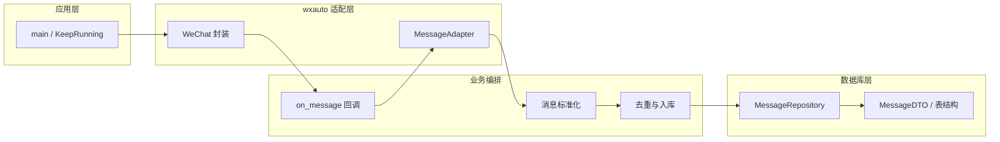

# 微信消息监听与入库 — 完整实现方案

> 本文档为项目完整设计与实现说明，便于评审与按步骤实现。

---

## 零、目录与命名（前置步骤）

在开始实现前，先做一次目录重命名，保证项目只依赖一套 wxauto：

- **wxauto**（当前目录）→ **wxauto_bac**：原实现备份，本项目不再使用。
- **wxauto_old**（当前目录）→ **wxauto**：作为本项目唯一使用的微信自动化核心。

完成后，项目内仅存在一个 **wxauto** 包（即原 wxauto_old），所有 `from wxauto import WeChat, Chat` 等均指向该包。

---

## 一、项目目标与约束

### 1.1 功能目标

- 监听**一个或多个**指定微信聊天窗口。
- 接收**所有类型**消息，并做**类型区分**：text / image / video / file / voice / link / location / system / time_separator / tickle / other 等。
- **文件 / 图片 / 视频**：下载到本地，数据库中记录**文件路径**。
- **链接**：记录**链接地址**（及可选标题等）。
- **位置**：记录**位置信息**（地址及可选经纬度等）。
- **系统消息**（撤回、入群通知等）、**时间分隔**、**拍一拍**：以专用类型记录，便于查询与过滤。
- 其余类型用统一可扩展方式记录（如 content + raw_info）。

### 1.2 设计约束

- **解耦**：① 对 wxauto 的调用 ② 对数据库的读写 ③ 其他业务（标准化、去重、配置）分离，便于后续替换或扩展。
- **不修改 wxauto 核心逻辑**：仅通过封装与回调使用，必要时在应用层扩展（如 link/location 解析）。

### 1.3 本项目使用的 wxauto 能力（重命名后的 wxauto）

- **WeChat**：主入口，构造时即启动后台监听线程。
- **AddListenChat(nickname: str, callback: Callable[[Message, str], None])**：为指定聊天打开独立子窗口并注册回调；新消息到达时调用 `callback(msg: Message, chat_name: str)`，其中 `chat_name` 是聊天名称字符串（非 Chat 对象）。
- **KeepRunning()**：主线程保活（内部 `while not stop: time.sleep(1)`），无需自写轮询循环。
- **Message 体系**：
  - **BaseMessage**：`msg.type`（text / image / video / file / voice / other）、`msg.attr`（human / friend / self / system / time / tickle）、`msg.content`、`msg.info`（dict）、`msg.id`（= `control.runtimeid`，仅会话内有效）、`msg.sender`、`msg.sender_remark`。
  - **chat_info()**：返回 Dict，包含聊天窗口信息。
  - **SystemMessage**（attr='system'）：撤回、入群通知等系统消息。
  - **TimeMessage**（attr='time'）：时间分隔线，`msg.time` 属性为 `datetime` 对象。
  - **TickleMessage**（attr='tickle'）：拍一拍，`msg.tickle_list` 包含参与者列表。
- **ImageMessage / VideoMessage**：继承 `MediaMessage`，提供 `download(dir_path=None, timeout=10) -> Path`。
- **FileMessage**：`download(dir_path=None, force_click=False, timeout=10) -> Path`，及 `filename`、`filesize` 属性。
- **VoiceMessage**：`to_text() -> str | WxResponse` 语音转文字。
- **链接 / 位置**：wxauto 未提供专门类型，需在应用层通过 content 正则或控件扩展识别并写入 DTO。

---

## 二、整体架构（三层解耦）



- **wxauto 适配层**：唯一直接依赖 wxauto。封装 `WeChat`、`AddListenChat`、`KeepRunning()`；在 callback 内将 wxauto 的 `Message` 通过 `MessageAdapter` 转成统一 **MessageDTO**（含 content_type、extra 等）。
- **数据库层**：只依赖 MessageDTO 与配置（如 DB 路径）。抽象 `MessageRepository`（save、exists_by_fingerprint 等），实现类如 SQLite，不依赖 wxauto。
- **业务编排**：主流程为「启动 → 为每个监听从配置读取 nickname → AddListenChat(nickname, callback) → KeepRunning()」；callback 内：MessageAdapter 标准化 → 按 fingerprint 去重 → Repository.save(dto)。配置、日志、异常处理在此层或 config 中完成。

---

## 三、消息类型与存储形态

| content_type     | 来源（wxauto / 应用层）                | 存储要点                                                        |
| ---------------- | --------------------------------- | ----------------------------------------------------------- |
| text             | wxauto `msg.type == 'text'`       | 存 `content`；类型相关数据放入 **`extra`**                              |
| image            | wxauto `ImageMessage`             | `msg.download(save_dir)` → 路径等存 **`extra`**，content 可为占位或摘要   |
| video            | wxauto `VideoMessage`             | 同上                                                          |
| file             | wxauto `FileMessage`              | 同上，文件名/大小等存 **`extra`**                                      |
| voice            | wxauto `VoiceMessage`             | 可选 `msg.to_text()` 存 content，或路径等存 **`extra`**                |
| link             | 应用层 content 正则或扩展                 | URL、title/desc 等存 **`extra`**                                 |
| location         | 应用层 content 正则或扩展                 | 地址、经纬度等存 **`extra`**                                          |
| system           | wxauto `SystemMessage`（attr='system'） | 存 `content`（如"xxx 撤回了一条消息"），sender_attr 设 'system'           |
| time_separator   | wxauto `TimeMessage`（attr='time'）     | `content` 存原始时间文本，`extra` 存 `{"time": "ISO格式时间"}`（来自 msg.time） |
| tickle           | wxauto `TickleMessage`（attr='tickle'） | `content` 存拍一拍文本，`extra` 存 `{"tickle_list": [...]}`          |
| other            | wxauto other 或 content 推断            | 存 `content` 或 raw_info                                       |

**说明**：

- **类型相关数据统一存 `extra`**：因已有 `content_type` 区分，不再为每种类型单独设字段。`extra` 为 JSON，按类型存不同结构，例如：image/video/file 存 `{"path": "本地路径", "download_status": "success"}`；link 存 `{"url": "...", "title": "..."}`；location 存 `{"address": "...", "lat": ..., "lng": ...}`。这样表结构更简单，扩展新类型只需扩展 JSON 结构。
- link / location 在 wxauto 中无专门类型，在 MessageAdapter 中根据 `msg.content` 或控件特征做正则/解析，若识别则设 content_type 并将数据写入 `extra`。
- **system / time_separator / tickle**：来自 wxauto 的 SystemMessage、TimeMessage、TickleMessage，通过 `msg.attr` 判断。可在配置中控制是否入库（默认入库），便于按需过滤。
- **引用消息（Phase 2）**：见第四节说明。

---

## 四、数据库设计（与 wxauto 解耦）

### 表：messages

| 字段                  | 说明                                                                                                                                                                                |
| ------------------- | --------------------------------------------------------------------------------------------------------------------------------------------------------------------------------- |
| `id`                | 主键（自增）                                                                                                                                                                            |
| `chat_name`         | 聊天对象名（群名/好友名）                                                                                                                                                                     |
| `chat_type`         | 聊天类型，来自 `chat_info()` 返回 Dict 中的相关字段；实现时需验证实际返回结构并做映射（如 friend / group 等）                                                                                                          |
| `sender`            | 发送者                                                                                                                                                                               |
| `sender_attr`       | self / friend / system（对应 `msg.attr`；human 映射为 friend，time/tickle 映射为 system）                                                                                                      |
| `content_type`      | text / image / video / file / voice / link / location / system / time_separator / tickle / other                                                                                  |
| `content`           | 文本内容或占位描述                                                                                                                                                                         |
| `extra`             | **JSON，类型相关数据统一放此**：image/video/file 存 `{"path": "本地路径", "download_status": "success/failed"}`；link 存 `{"url": "...", "title": "..."}`；location 存 `{"address": "...", "lat": null, "lng": null}`；tickle 存 `{"tickle_list": [...]}`；time_separator 存 `{"time": "ISO格式"}` 等。由 content_type 决定含义。 |
| `fingerprint`       | 内容指纹，用于去重，**来源见下**                                                                                                                                                                |
| `message_time`      | 消息时间（可空）。从最近一条 TimeMessage 的 `msg.time` 推断；若无法获取则为 NULL。**不等于入库时间**                                                                                                                |
| `created_at`        | 入库时间                                                                                                                                                                              |
| `raw_info`          | JSON，原始 `msg.info` 或扩展字段                                                                                                                                                          |

### 去重策略：fingerprint

由于 wxauto 基于 UI Automation，`control.runtimeid` 仅在当前会话内有效（微信或程序重启后会变化），**不适合作为持久化标识**。本项目采用**内容指纹（fingerprint）**去重：

- **生成规则**：`fingerprint = sha256(chat_name + sender + content_type + content_preview)`，其中 `content_preview` 为 content 的前 200 字符。
- **去重逻辑**：入库前检查 `exists_by_fingerprint(fingerprint, time_window)`，在时间窗口（如 24 小时，可配置）内若存在相同 fingerprint 的记录则跳过。
- **会话内去重**：wxauto 的 listener 已在会话内保证不会重复回调同一条消息，无需额外处理。
- **跨会话去重**：程序重启后，聊天窗口中可能仍有上次已处理的消息。通过 fingerprint + 时间窗口过滤。
- **已知局限**：
  - 同一聊天中同一发送者在时间窗口内发送完全相同的文本，会被误判为重复。实际场景中较罕见。
  - 不同图片/视频若 content 占位文本相同（如均为"[图片]"），需在 fingerprint 中加入更多区分信息（如文件大小、下载路径）以降低误判。

### 引用消息（Phase 2）

当前 wxauto 仅提供 `quote()` 方法（主动引用），**未提供检测收到的消息是否为引用消息的能力**，也不暴露被引用消息的标识。因此：

- **Phase 1（当前）**：表结构中暂不包含 `quoted_message_id` 字段。若后续实现，通过 ALTER TABLE 添加即可。
- **Phase 2（待补充）**：当 wxauto 支持或找到可靠的引用检测方式（如解析控件子结构、content 正则识别引用格式）后，增加以下能力：
  - 表中添加 `quoted_message_id`（外键指向本表 `id`）。
  - MessageAdapter 中增加引用检测逻辑。
  - Repository 增加按内容检索被引用消息 id 的方法。
  - 无法精确匹配时，将引用摘要存入 `raw_info`，`quoted_message_id` 留 NULL。

### MessageRepository

- **抽象接口**：
  - `save(dto: MessageDTO)`
  - `exists_by_fingerprint(fingerprint: str, time_window_hours: int = 24) -> bool`
  - 可选：`list_by_chat(chat_name, limit)`
- **实现**：如 `SQLiteMessageRepository`，只依赖 MessageDTO 与 DB 配置。

### 线程安全

多个聊天的 callback 可能在不同线程中并发触发。SQLite 需做如下处理：

- 连接创建时设置 `check_same_thread=False`。
- 启用 **WAL 模式**（`PRAGMA journal_mode=WAL`），提升并发读写性能。
- 所有写操作（save）通过 **threading.Lock** 序列化，避免写冲突。

---

## 五、日志模块（完备日志，重点消息类型识别）

### 位置与职责

- 独立模块 **`src/logger.py`**，在应用启动时初始化；各层（adapter、repository、app）统一使用该模块，便于解耦与后续对接日志采集。

### 与 wxauto 内置日志的协调

wxauto 包自带 `logger.py`。本项目使用 Python `logging` 标准库的**命名空间机制**统一管理：

- wxauto 内部日志使用 `logging.getLogger("wxauto")` 命名空间。
- 本项目各模块使用 `logging.getLogger("wxauto_pro.xxx")` 命名空间（如 `wxauto_pro.adapter`、`wxauto_pro.repository`）。
- 在 `src/logger.py` 中统一配置 root logger 或按命名空间分别设置 handler/level，避免冲突。

### 日志级别与用途

| 级别        | 用途                                                                                             |
| --------- | ---------------------------------------------------------------------------------------------- |
| **DEBUG** | 消息类型识别过程、分支判断依据（如 `msg.type`、`msg.attr`、控件特征、content 正则匹配结果）、下载/解析的中间步骤                        |
| **INFO**  | 启动/停止、AddListenChat 注册、每条消息的**最终识别结果**（chat_name、content_type、fingerprint）、入库成功或跳过（去重） |
| **WARNING** | 下载超时/失败、链接/位置解析失败、无法获取 message_time                                                             |
| **ERROR** | callback 内异常、repository.save 失败、wx 调用异常                                                        |

### 消息类型识别处必须打日志（MessageAdapter 内）

1. **收到原始 msg 时**：打 DEBUG，如 `msg.type=..., msg.attr=..., content_preview=...`。
2. **每个类型分支**：进入 text / image / video / file / voice / link / location / system / time_separator / tickle / other 时打 DEBUG，带原因（如 `type=image from msg.type`、`type=link from content regex`）。
3. **识别完成后**：打 INFO，包含 chat_name、content_type、fingerprint、extra 概要。

### 其他约定

- 日志格式中可固定包含 `chat_name`、`content_type`，便于检索与排查；异常时记录 traceback。
- 日志输出目标（控制台/文件）、级别、轮转等由 config 或环境变量控制，与业务配置解耦。

---

## 六、模块与目录结构

重命名完成后，项目结构建议如下：

```
wxauto-pro/
├── wxauto/                    # 唯一 wxauto 核心（由 wxauto_old 重命名而来）
│   ├── __init__.py
│   ├── wx.py                  # WeChat、Chat、Listener
│   ├── msgs/                  # 消息类型定义（base/type/attr/msg/self/friend）
│   ├── ui/                    # UI 控件封装（main/chatbox/component 等）
│   ├── utils/                 # 工具函数
│   ├── param.py               # WxParam、WxResponse
│   ├── logger.py              # wxauto 内置日志
│   ├── exceptions.py
│   ├── languages.py
│   └── uiautomation.py        # UI Automation 封装
├── wxauto_bac/                # 备份，本项目不引用（由原 wxauto 重命名）
├── src/
│   ├── __init__.py
│   ├── logger.py              # 日志模块：初始化、级别、格式；与 wxauto 日志通过命名空间协调
│   ├── config.py              # 监听的聊天列表、DB 路径、下载根目录、日志配置等
│   ├── models.py              # MessageDTO、ContentType 枚举、SenderAttr 枚举等
│   ├── repository.py          # MessageRepository 抽象 + SQLite 实现
│   ├── message_adapter.py     # wxauto Message → MessageDTO；下载/链接/位置解析；类型识别
│   ├── wx_facade.py           # 可选：对 WeChat / AddListenChat / KeepRunning 的薄封装
│   └── app.py                 # 入口：初始化、注册 callback、AddListenChat、KeepRunning
├── requirements.txt           # 依赖清单
├── DESIGN.md                  # 本实现方案文档
└── README.md
```

- **对 wxauto 的调用**：仅在 `wx_facade.py`（若存在）与 `message_adapter.py`、`app.py` 中；通过 `from wxauto import WeChat, Chat` 使用。
- **对数据库的调用**：仅在 `repository.py` 及其实现中，依赖 `models.MessageDTO`。
- **日志**：`src/logger.py` 在启动时初始化，配置 `wxauto_pro.*` 和 `wxauto` 两个命名空间；adapter / repository / app 统一使用，消息类型识别各分支与入库结果必须打日志。
- **配置与入口**：`src/config.py` 提供监听列表、存储路径、日志输出与级别、去重时间窗口等；`app.py` 负责启动与 callback 编排。

---

## 七、核心流程（顺序）

1. **启动**：读 config（监听的 nickname 列表、DB 路径、下载根目录等）；初始化 logger（配置 `wxauto_pro` 与 `wxauto` 命名空间）；初始化 `WeChat()`（wxauto 内部已起监听线程）；创建 `MessageRepository`（启用 WAL 模式、写锁）、`MessageAdapter`（注入 save_dir 等）。
2. **注册监听**：对每个 nickname 调用 `AddListenChat(nickname, callback=on_message)`，打 INFO 日志。
3. **on_message(msg: Message, chat_name: str)**（每条新消息）：
   - 用 MessageAdapter 将 `(msg, chat_name)` 转为 MessageDTO：
     - 先判断 `msg.attr`：若为 `'time'` → content_type=time_separator；若为 `'tickle'` → content_type=tickle；若为 `'system'` → content_type=system；其他进入用户消息分支。
     - 用户消息的 `content_type` 由 `msg.type` 及 content 正则确定（text / image / video / file / voice / link / location / other）。
     - 类型相关数据（路径、url、地址等）统一写入 **`extra`**（JSON）。
     - 若 image/video/file 则调用 `msg.download(save_dir)`，成功则 `extra.path` 写入路径、`extra.download_status = "success"`；失败则 `extra.download_status = "failed"`，打 WARNING，消息仍入库。
     - 若 voice 可选 `msg.to_text()` 存 content，或路径入 extra。
     - link/location 由 content 正则解析后写入 extra。
     - **message_time**：维护一个"当前聊天最近 TimeMessage 时间"变量，每遇到 TimeMessage 时更新；后续消息的 `message_time` 取该值；无 TimeMessage 时为 NULL。
     - **fingerprint**：按规则生成内容指纹（见第四节）。
   - **日志**：识别过程中各类型分支打 DEBUG，识别结果打 INFO；入库前若去重跳过也打 INFO。
   - 若 `repository.exists_by_fingerprint(fingerprint, time_window)` 为 True 则跳过。
   - 否则 `repository.save(dto)`，成功或失败打 INFO/ERROR。
   - 异常在 callback 内 try/except 并打 ERROR + traceback，不影响监听线程。
4. **主线程**：`wx.KeepRunning()`，直到进程退出。

---

## 八、解耦要点小结

| 关注点          | 做法                                                                                  |
| ------------ | ----------------------------------------------------------------------------------- |
| 替换 wxauto 或消息源 | 只改 wx_facade + message_adapter，保持输出为 MessageDTO；app 与 repository 不变。                  |
| 更换数据库        | 新增 Repository 实现并注入；表结构按 DTO 映射。                                                     |
| 新增消息类型或字段    | 在 MessageDTO 与表中增加字段；在 MessageAdapter 中补充类型与填充逻辑。                                    |
| 下载/存储策略      | 下载根目录、是否下载视频等由 config 控制；下载仅在 adapter 中调用 `msg.download()`；失败时记录 download_status。     |
| 引用关系（Phase 2） | 待 wxauto 支持引用检测后，添加 `quoted_message_id` 字段与相关逻辑。                                     |
| 日志           | 独立 logger 模块，通过命名空间与 wxauto 内置日志协调；类型识别与入库结果必打日志；更换输出/级别只改 logger 与 config。         |
| 线程安全         | SQLite WAL 模式 + 写操作 Lock 序列化。                                                       |
| 系统消息过滤       | system / time_separator / tickle 默认入库，可通过 config 配置跳过。                                |

---

## 九、实现顺序建议

1. **目录重命名**：wxauto → wxauto_bac，wxauto_old → wxauto。
2. **logger**：实现 `src/logger.py`，使用 `logging` 标准库命名空间机制；配置 `wxauto_pro.*` 命名空间供本项目使用，同时管理 `wxauto` 命名空间的输出；支持 config 控制输出目标与级别。
3. **models**：定义 MessageDTO、ContentType 枚举（含 text / image / video / file / voice / link / location / system / time_separator / tickle / other）、SenderAttr 枚举（self / friend / system）。
4. **repository**：MessageRepository 抽象 + SQLite 实现；建表按第四节表结构；启用 WAL 模式与写操作 Lock；实现 save、exists_by_fingerprint。
5. **message_adapter**：输入 `(msg: Message, chat_name: str)`；先按 `msg.attr` 分流系统类消息（system / time / tickle），再按 `msg.type` + content 正则处理用户消息；每条消息打 DEBUG（原始 type/attr/content 预览）；类型相关数据统一写 `extra`（JSON）；image/video/file 调用 `msg.download(save_dir)` 将路径等写入 extra（失败时 download_status='failed'，打 WARNING）；voice 可选 to_text() 或路径入 extra；link/location 用 content 正则写入 extra；生成 fingerprint；维护 message_time（取最近 TimeMessage 的 msg.time）；识别结束打 INFO；输出 MessageDTO。
6. **app**：启动时初始化 logger；读 config；WeChat()；对每个 nickname 执行 `AddListenChat(nickname, on_message)`；`on_message(msg, chat_name)` 内 adapter → 去重（存在则打 INFO）→ repository.save，打 INFO/ERROR；主线程 KeepRunning()。
7. **config**：监听列表、DB 路径、下载根目录、日志级别与输出路径、去重时间窗口、系统消息是否入库等。

**说明**：重命名后 wxauto 内部仍为 `from wxauto.xxx`，无需改为 wxauto_old；项目内仅保留一个 wxauto 包即可正常导入。

---

## 十、依赖清单（requirements.txt）

| 包 | 用途 |
|---|------|
| `comtypes` | wxauto 依赖，UI Automation COM 接口 |
| `Pillow` | 可选，图片处理（若需要缩略图等） |

> `sqlite3` 为 Python 标准库，无需额外安装。其余依赖根据实现需要补充。
