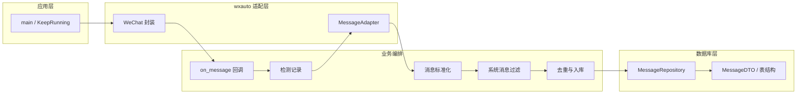

# 微信消息监听与入库 — 设计与实现文档

> 本文档为项目完整设计与实现说明。

---

## 一、项目目标与约束

### 1.1 功能目标

- 监听**一个或多个**指定微信聊天窗口。
- 接收**所有类型**消息，并做**类型区分**：text / image / video / file / voice / link / card / mini_program / video_account / location / system / time_separator / tickle / quote / other。
- **文件 / 图片 / 视频**：下载到本地（按 `群/群名` 或 `人/好友名` 分目录），数据库中记录**相对文件路径**。
- **链接卡片**：从控件树提取**标题、描述、来源**。
- **位置**：从控件树提取**地点名称与详细地址**。
- **个人名片**：提取名片标题与描述。
- **小程序**：识别并提取标题与描述。
- **视频号**：识别并提取频道/视频标题。
- **引用/回复消息**：解析回复内容与被引用内容，对引用的图片/视频通过 UI 导航下载媒体，对引用的文件从 DB 查找原始路径。
- **系统消息**（撤回、入群通知等）、**时间分隔**、**拍一拍**：以专用类型记录，便于查询与过滤。
- **语音**：可选自动转文字，带超时保护（默认 20 秒）。
- 其余类型用统一可扩展方式记录（content + raw_info）。

### 1.2 设计约束

- **解耦**：① 对 wxauto 的调用 ② 对数据库的读写 ③ 其他业务（标准化、去重、配置）分离，便于后续替换或扩展。
- **不修改 wxauto 核心逻辑**：仅通过封装与回调使用，必要时在应用层扩展（如 link/location/quote 解析）。

### 1.3 本项目使用的 wxauto 能力

- **WeChat**：主入口，构造时即启动后台监听线程。
- **AddListenChat(nickname, callback)**：为指定聊天打开独立子窗口并注册回调；新消息到达时调用 `callback(msg: Message, chat: Chat)`，其中 `chat` 是 Chat 对象（通过 `chat.who` 获取聊天名称）。
- **KeepRunning()**：主线程保活（内部 `while not stop: time.sleep(1)`），无需自写轮询循环。
- **Message 体系**：
  - **BaseMessage**：`msg.type`（text / image / video / file / voice / other）、`msg.attr`（human / friend / self / system / time / tickle）、`msg.content`、`msg.info`（dict）、`msg.id`（= `control.runtimeid`，仅会话内有效）、`msg.sender`、`msg.sender_remark`。
  - **chat_info()**：返回 Dict，包含聊天窗口信息（含 `chat_type`：friend / group）。
  - **SystemMessage**（attr='system'）：撤回、入群通知等系统消息。
  - **TimeMessage**（attr='time'）：时间分隔线，`msg.time` 属性为 `datetime` 对象。
  - **TickleMessage**（attr='tickle'）：拍一拍，`msg.tickle_list` 包含参与者列表。
- **ImageMessage / VideoMessage**：继承 `MediaMessage`，提供 `download(dir_path=None, timeout=30) -> Path`。下载通过右键→复制→剪贴板文件路径→copyfile 实现，含重试机制与气泡精确定位。
- **FileMessage**：`download(dir_path=None, force_click=False, timeout=30) -> Path`，及 `filename`、`filesize` 属性。
- **VoiceMessage**：`to_text() -> str | WxResponse` 语音转文字。
- **链接 / 位置 / 名片 / 小程序 / 视频号 / 引用**：wxauto 未提供专门类型（均为 TextMessage 或 OtherMessage），在应用层通过 content 正则 + 控件树解析识别并分类。

---

## 二、整体架构（三层解耦）



- **wxauto 适配层**：唯一直接依赖 wxauto。`WxFacade` 封装 `WeChat`、`AddListenChat`、`KeepRunning()`；`MessageAdapter` 将 wxauto 的 `Message` 转成统一 **MessageDTO**（含 content_type、extra 等），并通过控件树解析提取卡片/位置/引用等信息。
- **数据库层**：只依赖 MessageDTO 与配置。抽象 `MessageRepository`（save、exists_by_fingerprint 等），SQLite 实现，不依赖 wxauto。含 `detect_log` 表用于调试。
- **业务编排**：主流程为「启动 → 读配置 → AddListenChat → KeepRunning」；callback 内：detect_log 记录 → MessageAdapter 标准化 → 系统消息过滤 → fingerprint 去重 → Repository.save(dto)。

---

## 三、消息类型与存储形态

| content_type     | 来源                                      | 存储要点                                                                                   |
| ---------------- | ----------------------------------------- | ------------------------------------------------------------------------------------------ |
| text             | wxauto `msg.type == 'text'`               | 存 `content`；若含 URL 则识别为 link                                                        |
| image            | wxauto `ImageMessage`                     | `msg.download(save_dir)` → `extra.path`（相对路径）、`extra.download_status`                 |
| video            | wxauto `VideoMessage`                     | 同上                                                                                       |
| file             | wxauto `FileMessage`                      | 同上，加 `extra.filename`、`extra.filesize`                                                 |
| voice            | wxauto `VoiceMessage`                     | 可选 `msg.to_text()` 存 content（超时 20 秒），`extra.voice_text` / `extra.voice_to_text_status` |
| link             | 应用层 content regex / 控件树（卡片来源）  | `extra.url` 或 `extra.title` / `extra.description` / `extra.source`                         |
| card             | 应用层 content `[名片]` + 控件树            | `extra.title`、`extra.description`                                                          |
| mini_program     | 应用层 控件树 source="小程序"               | `extra.title`、`extra.description`                                                          |
| video_account    | 应用层 content `[视频号]` + 控件树          | `extra.title`、`extra.description`                                                          |
| location         | 应用层 content regex + 控件树               | `extra.address`（地点名称）、`extra.detail`（详细地址）、`extra.lat`、`extra.lng`              |
| system           | wxauto `SystemMessage`（attr='system'）    | 存 `content`（如"xxx 撤回了一条消息"），sender_attr 设 'system'                                |
| time_separator   | wxauto `TimeMessage`（attr='time'）        | `content` 存原始时间文本，`extra.time` 存 ISO 格式时间（来自 msg.time）                        |
| tickle           | wxauto `TickleMessage`（attr='tickle'）    | `content` 存拍一拍文本，`extra.tickle_list` 存参与者列表                                      |
| quote            | 应用层 content 正则（`\n引用  的消息 :`）   | `extra.reply_content`、`extra.quoted_sender`、`extra.quoted_content`、`extra.quoted_type`；媒体引用含 `extra.path` / `extra.download_status` |
| other            | wxauto other 且未匹配上述规则               | 存 `content` 与 raw_info                                                                    |

### 类型识别优先级

MessageAdapter 的识别顺序：

1. **按 `msg.attr` 分流系统类**：time → tickle → system
2. **引用消息拦截**（在类型分发之前，防止引用文件触发下载）：content 匹配 `QUOTE_PATTERN`
3. **按 `msg.type` 分发用户消息**：text → image → video → file → voice → other
4. **text 细分**：content 含 URL → link，否则纯文本
5. **other 细分**（控件树 + 正则）：位置 → 名片 → 视频号 → 链接卡片 `[音乐/链接/公众号]` → 控件树兜底检测（有 source 的视为 link 或 mini_program）→ 真 other

### 控件树解析

wxauto 中链接卡片、位置、引用等消息无专门类型，在 MessageAdapter 中通过控件树分析提取结构化信息：

- **`_extract_link_card_info(msg)`**：遍历 TextControl 子控件，提取标题（第 1 个）、描述（第 2 个）、来源（第 3 个，如"哔哩哔哩"、"小程序"等）。
- **`_extract_location_address(msg)`**：遍历 TextControl，跳过 `[位置]`/`查看位置`，提取地点名称（第 1 个）和详细地址（第 2 个）。
- **`_extract_quote_info(msg, reply_content)`**：遍历控件树收集 TextControl，跳过回复文字后，解析 `发送者 : 内容` 格式；检测特殊控件名（如 `[位置]`）推断被引用类型。
- **`_find_quoted_pane(control)`**：定位引用区 PaneControl（有 ≥2 个 PaneControl 子节点，第二个含 ` : ` 标记）。
- **`_find_media_in_quoted_pane(quoted_pane, quoted_type)`**：在引用区中查找 ButtonControl（图片/视频缩略图）。

---

## 四、数据库设计（与 wxauto 解耦）

### 表：messages

| 字段             | 说明                                                                                                                      |
| ---------------- | ------------------------------------------------------------------------------------------------------------------------- |
| `id`             | 主键（自增）                                                                                                                |
| `chat_name`      | 聊天对象名（群名/好友名）                                                                                                   |
| `chat_type`      | 聊天类型，来自 `chat_info()` 返回 Dict 中的 `chat_type` 字段（friend / group 等）                                             |
| `sender`         | 发送者                                                                                                                     |
| `sender_attr`    | self / friend / system（对应 `msg.attr`；human 映射为 friend，time/tickle 映射为 system）                                     |
| `content_type`   | text / image / video / file / voice / link / card / mini_program / video_account / location / system / time_separator / tickle / quote / other |
| `content`        | 文本内容或占位描述                                                                                                           |
| `extra`          | **JSON，类型相关数据统一放此**（由 content_type 决定含义，见第三节表格）                                                        |
| `fingerprint`    | 内容指纹，用于去重（见下）                                                                                                    |
| `message_time`   | 消息时间（可空），从最近一条 TimeMessage 的 `msg.time` 推断；**不等于入库时间**                                                  |
| `created_at`     | 入库时间                                                                                                                    |
| `raw_info`       | JSON，原始 `msg.info`                                                                                                       |

### 表：detect_log（调试用）

在消息处理/过滤/去重**之前**立即记录检测到的原始消息，用于排查是否漏消息。

| 字段             | 说明                           |
| ---------------- | ------------------------------ |
| `id`             | 主键（自增）                    |
| `chat_name`      | 聊天对象名                      |
| `msg_type`       | wxauto 原始 msg.type            |
| `msg_attr`       | wxauto 原始 msg.attr            |
| `sender`         | 发送者                          |
| `content_preview`| content 前 80 字符              |
| `runtime_id`     | 控件 runtimeid                  |
| `detected_at`    | 检测时间                        |

### 去重策略：fingerprint

由于 wxauto 基于 UI Automation，`control.runtimeid` 仅在当前会话内有效（微信或程序重启后会变化），**不适合作为持久化标识**。本项目采用**内容指纹（fingerprint）**去重：

- **生成规则**：`fingerprint = sha256(chat_name \x00 sender \x00 content_type \x00 content_preview \x00 extra_key \x00 msg_id \x00 message_time)`
  - `content_preview`：content 前 200 字符
  - `extra_key`：媒体消息的下载路径或文件名（区分不同文件）
  - `msg_id`：控件 runtimeid（确保同名文件多次发送不被误去重）
  - `message_time`：最近 TimeMessage 的时间（同一内容在不同时间段分别入库）
- **去重逻辑**：入库前检查 `exists_by_fingerprint(fingerprint, time_window)`，在时间窗口（默认 24 小时，可配置）内若存在相同 fingerprint 的记录则跳过。
- **会话内去重**：wxauto 的 listener 已在会话内保证不会重复回调同一条消息。
- **跨会话去重**：程序重启后，聊天窗口中可能仍有上次已处理的消息。通过 fingerprint + 时间窗口过滤。

### 引用消息处理

当收到的消息 content 匹配 `QUOTE_PATTERN`（`\n引用\s+的消息\s*:\s*`）时，识别为引用消息：

1. **解析回复与被引用内容**：将 content 按正则分为 `reply_content`（回复文字）和 `quoted_raw`（被引用内容）。
2. **推断被引用类型**：
   - 文本推断：`[图片]` → image、`[视频]` → video、文件名特征 → file 等
   - 控件树修正：通过 `_extract_quote_info()` 检测特殊控件名（如 `[位置]`）
   - DB 辅助修正：在数据库中搜索匹配的消息记录获取其 content_type
3. **媒体引用下载**：对图片/视频引用，通过 `_navigate_quote_and_download()` 点击引用区缩略图 → 打开预览窗口 → 右键复制 → 从剪贴板获取文件。
4. **文件引用查找**：通过 `_lookup_file_path_from_db()` 从 DB 中查找原始文件的路径信息。

### MessageRepository

- **抽象接口**：
  - `save(dto: MessageDTO) -> int`
  - `exists_by_fingerprint(fingerprint: str, time_window_hours: int = 24) -> bool`
  - `list_by_chat(chat_name: str, limit: int = 50) -> List[MessageDTO]`
  - `find_quoted_message_id(chat_name: str, quoted_content: str, quoted_type: str) -> Optional[int]`
- **实现**：`SQLiteMessageRepository`，只依赖 MessageDTO 与 DB 配置。
- **调试接口**：`log_detect(chat_name: str, msg)` — 在处理前记录原始消息到 detect_log 表。

### 线程安全

多个聊天的 callback 可能在不同线程中并发触发。SQLite 处理：

- 连接创建时设置 `check_same_thread=False`。
- 启用 **WAL 模式**（`PRAGMA journal_mode=WAL`），提升并发读写性能。
- 所有写操作（save、log_detect）通过 **threading.Lock** 序列化，避免写冲突。

---

## 五、日志模块

### 位置与职责

- 独立模块 **`src/logger.py`**，在应用启动时初始化；各层统一使用。

### 与 wxauto 内置日志的协调

- wxauto 内部日志使用 `logging.getLogger("wxauto")` 命名空间。
- 本项目各模块使用 `logging.getLogger("wxauto_pro.xxx")` 命名空间（如 `wxauto_pro.adapter`、`wxauto_pro.repository`、`wxauto_pro.app`、`wxauto_pro.facade`）。
- 在 `src/logger.py` 中统一配置两个命名空间的 handler 和 level。
- 每次启动生成带时间戳的新日志文件（如 `app_20260317_110000.log`），便于重启后排查。

### 日志级别与用途

| 级别        | 用途                                                                                             |
| ----------- | ------------------------------------------------------------------------------------------------ |
| **DEBUG**   | 消息类型识别过程、分支判断依据、下载/解析中间步骤、控件树 dump                                      |
| **INFO**    | 启动/停止、注册监听、每条消息最终识别结果、入库成功或去重跳过                                        |
| **WARNING** | 下载超时/失败、语音转文字超时/失败、解析失败                                                        |
| **ERROR**   | callback 内异常、repository.save 失败                                                              |

---

## 六、模块与目录结构

```
wxauto-pro/
├── wxauto/                    # 唯一 wxauto 核心（由 wxauto_old 重命名而来）
│   ├── __init__.py
│   ├── wx.py                  # WeChat、Chat、Listener
│   ├── msgs/                  # 消息类型定义
│   │   ├── base.py            # Message、BaseMessage、HumanMessage
│   │   ├── attr.py            # SystemMessage、TimeMessage、TickleMessage、FriendMessage、SelfMessage
│   │   ├── type.py            # TextMessage、MediaMessage、ImageMessage、VideoMessage、VoiceMessage、FileMessage、OtherMessage
│   │   ├── msg.py             # parse_msg_attr / parse_msg_type — 控件→消息类型识别
│   │   ├── friend.py          # Friend* 组合类
│   │   └── self.py            # Self* 组合类
│   ├── ui/                    # UI 控件封装（main/chatbox/sessionbox/navigationbox/component）
│   ├── utils/                 # 工具函数（tools/win32）
│   ├── param.py               # WxParam、WxResponse
│   ├── logger.py              # wxauto 内置日志
│   ├── exceptions.py
│   ├── languages.py
│   └── uiautomation.py        # UI Automation 封装
├── wxauto_bac/                # 备份，本项目不引用
├── src/
│   ├── __init__.py
│   ├── logger.py              # 日志模块：命名空间、格式、文件/控制台输出
│   ├── config.py              # AppConfig：监听列表、DB 路径、下载目录、日志、去重窗口、语音转文字超时等
│   ├── models.py              # MessageDTO、ContentType 枚举（15 种）、SenderAttr 枚举
│   ├── repository.py          # MessageRepository 抽象 + SQLiteMessageRepository（含 detect_log）
│   ├── message_adapter.py     # wxauto Message → MessageDTO；下载/控件树解析/引用处理/类型识别
│   ├── wx_facade.py           # 对 WeChat / AddListenChat / KeepRunning 的薄封装
│   └── app.py                 # App 类：初始化、注册 callback、消息回调流程编排
├── data/                      # SQLite 数据库目录
├── downloads/                 # 下载文件根目录（按 群/人 分子目录）
├── wxauto_logs/               # 日志文件目录
├── main.py                    # 入口脚本
├── requirements.txt
└── DESIGN.md                  # 本文档
```

---

## 七、核心流程

1. **启动**：读 AppConfig（监听列表、DB 路径、下载目录等）；初始化 logger（配置 `wxauto_pro` 与 `wxauto` 命名空间）；初始化 `SQLiteMessageRepository`（建表、启用 WAL 模式）；初始化 `MessageAdapter`（注入 save_dir、voice_to_text 配置、repo 引用）；初始化 `WxFacade`（内部创建 `WeChat(debug=True)`）。
2. **注册监听**：对每个 nickname 调用 `wx.add_listen_chat(nickname, on_message)`。
3. **on_message(msg: Message, chat: Chat)**（每条新消息）：
   - 从 Chat 对象提取 `chat_name = chat.who`。
   - **detect_log**：立即将原始消息写入 detect_log 表（在任何处理之前）。
   - **adapt**：用 MessageAdapter 将 `(msg, chat_name)` 转为 MessageDTO：
     - 按 `msg.attr` 分流：time → tickle → system
     - 引用拦截：content 匹配 `QUOTE_PATTERN` → 引用消息处理（解析、控件树提取、媒体下载/DB 查找）
     - 按 `msg.type` 分发：text（含 link 检测）→ image → video → file → voice → other（含 location / card / video_account / link 卡片 / mini_program 检测）
     - 媒体消息调用 `msg.download(save_dir)` 下载到 `群/群名` 或 `人/好友名` 子目录
     - 语音可选 `msg.to_text()`，在独立线程中运行，超时 20 秒
     - 生成 fingerprint（含 message_time、msg_id、extra_key）
   - **过滤**：按配置跳过 system / time_separator / tickle 消息。
   - **去重**：`exists_by_fingerprint(fingerprint, dedup_window_hours)` 为 True 则跳过。
   - **入库**：`repository.save(dto)`。
   - 异常在 callback 内 try/except 并打 ERROR + traceback，不影响监听线程。
4. **主线程**：`wx.keep_running()`，直到进程退出。

---

## 八、配置项（AppConfig）

| 配置项                        | 类型       | 默认值                | 说明                                       |
| ----------------------------- | ---------- | --------------------- | ------------------------------------------ |
| `listen_chats`                | List[str]  | []                    | 监听的聊天列表（群名或好友名）               |
| `db_path`                     | str        | data/messages.db      | SQLite 数据库路径                            |
| `download_dir`                | str        | downloads             | 下载文件根目录                               |
| `log_level`                   | str        | INFO                  | 日志级别                                     |
| `log_file`                    | str        | ""                    | 日志文件路径，为空则仅控制台                  |
| `dedup_window_hours`          | int        | 24                    | 去重时间窗口（小时）                          |
| `store_system_messages`       | bool       | True                  | 系统消息是否入库                              |
| `store_time_separators`       | bool       | True                  | 时间分隔消息是否入库                          |
| `store_tickle_messages`       | bool       | True                  | 拍一拍消息是否入库                            |
| `voice_to_text`               | bool       | True                  | 语音是否自动转文字                            |
| `voice_to_text_timeout_seconds` | int      | 20                    | 语音转文字超时时间（秒）                      |

---

## 九、解耦要点小结

| 关注点              | 做法                                                                                       |
| ------------------- | ------------------------------------------------------------------------------------------ |
| 替换 wxauto 或消息源 | 只改 wx_facade + message_adapter，保持输出为 MessageDTO；app 与 repository 不变               |
| 更换数据库           | 新增 Repository 实现并注入；表结构按 DTO 映射                                                |
| 新增消息类型         | 在 ContentType 枚举增加值；在 MessageAdapter 中补充识别与填充逻辑                              |
| 下载/存储策略        | 下载根目录由 config 控制；下载仅在 adapter 中调用；失败时记录 download_status                   |
| 日志                 | 独立 logger 模块，通过命名空间与 wxauto 日志协调；类型识别与入库结果必打日志                     |
| 线程安全             | SQLite WAL 模式 + 写操作 Lock 序列化                                                         |
| 系统消息过滤         | system / time_separator / tickle 默认入库，可通过 config 配置跳过                              |

---

## 十、依赖清单（requirements.txt）

| 包         | 用途                                 |
| ---------- | ------------------------------------ |
| `comtypes` | wxauto 依赖，UI Automation COM 接口   |
| `Pillow`   | 可选，图片处理（若需要缩略图等）       |

> `sqlite3` 为 Python 标准库，无需额外安装。
